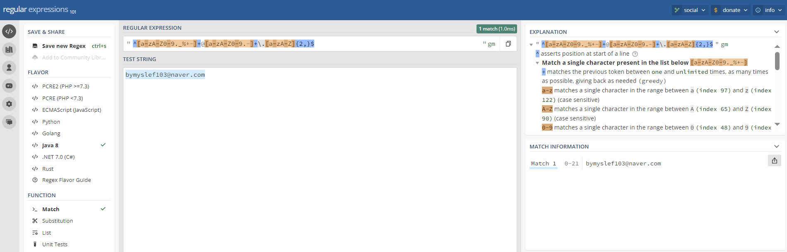

# 12_java.base 모듈

### 1. java api 문서

자바 표준 모듈에서 제공하는 라이브러리를 사용할 때는 API 문서가 매우 유용합니다. API 문서는 해당 라이브러리의 클래스, 메서드, 필드 등에 대한 설명을 포함하고 있어 개발자가 필요한 기능을 찾고 사용할 수 있도록 도와줍니다.

일반적으로 자바 표준 라이브러리의 API 문서는 Oracle 또는 OpenJDK 공식 웹사이트에서 제공됩니다. 이 문서들은 Java SE (Standard Edition)의 각 버전에 대한 것으로 구성되어 있으며, 주로 javadoc 형식으로 작성되어 있습니다. javadoc은 소스 코드 주석을 기반으로 자동으로 생성되므로 라이브러리 개발자가 코드를 작성할 때 주석을 잘 작성하는 것이 중요합니다.

API 문서를 통해 개발자는 원하는 클래스 또는 메서드를 쉽게 찾을 수 있으며, 각 항목에는 해당 기능의 설명, 사용 예제, 매개변수 및 반환 값에 대한 정보 등이 포함되어 있습니다. 또한 클래스 간의 관계도 그래픽으로 표현되어 있어서 개발자가 라이브러리의 구조를 이해하는 데 도움이 됩니다.

API 문서를 사용하여 자바 표준 라이브러리의 다양한 기능을 효과적으로 활용할 수 있으며, 이는 개발 작업을 보다 효율적으로 수행할 수 있도록 도와줍니다.

### 2. object 클래스

Object 클래스는 자바의 모든 클래스의 부모 클래스이며, 자바에서 가장 상위에 위치한 클래스입니다. 모든 클래스는 암묵적으로 Object 클래스를 상속받습니다.

Object 클래스는 자바의 기본적인 메서드들을 제공하며, 이를 통해 모든 객체는 공통적으로 사용할 수 있는 기능을 가집니다. 예를 들어, Object 클래스는 객체의 해시 코드를 반환하는 hashCode() 메서드, 객체의 문자열 표현을 반환하는 toString() 메서드, 객체의 동일성을 비교하는 equals() 메서드 등을 제공합니다.

따라서 모든 클래스는 이러한 Object 클래스의 기능들을 상속받아 사용할 수 있습니다. 또한 이러한 메서드들을 필요에 맞게 오버라이딩하여 자신의 클래스에 맞게 재정의할 수도 있습니다. 이러한 특성으로 인해 객체의 기본 동작을 제어하고 다양한 객체 간의 비교 및 동일성 검사를 수행할 수 있습니다.

### 3. 레코드의 도입

자바 14부터는 데이터 전달을 위한 간단한 불변 데이터 컨테이너를 생성하기 위한 새로운 기능으로서, 레코드(Records)가 도입되었습니다. 이전에는 데이터 전달을 위해 보통 DTO(Data Transfer Object)를 사용했는데, 이는 일정한 규칙을 따라 작성해야 했고, 불필요한 코드를 작성해야 하는 단점이 있었습니다.

레코드는 클래스와 마찬가지로 데이터를 저장하고 메서드를 가질 수 있지만, 간결하고 명확한 구문으로 데이터 전달을 위한 클래스를 정의할 수 있습니다. 레코드를 사용하면 자동으로 접근자 메서드, equals(), hashCode(), toString() 메서드가 생성되므로 반복적인 작업을 줄일 수 있습니다. 또한, 레코드는 불변성을 강제하므로 안전한 다중 스레드 환경에서 사용할 수 있습니다.


```java
public record Person(String name, int age) {}
```

위의 코드는 이름과 나이를 저장하는 간단한 Person 클래스를 정의합니다. 이 클래스는 자동으로 접근자 메서드인 getName(), getAge()를 생성하고, equals(), hashCode(), toString() 메서드도 자동으로 구현됩니다. 이렇게 간단하게 정의된 레코드를 사용하여 데이터 전달을 위한 클래스를 만들면 코드의 가독성과 유지보수성이 향상됩니다.

### 4. 롬복

롬복(Lombok)은 Java 언어를 위한 자동 코드 생성 라이브러리입니다. 롬복은 Java 코드에서 보일러플레이트 코드를 줄이고 개발자의 생산성을 향상시키기 위해 사용됩니다.

롬복은 어노테이션을 사용하여 컴파일 시점에 코드를 생성하며, 주요 기능으로는 게터(Getter), 세터(Setter), 생성자(Constructor), equals(), hashCode(), toString() 메서드 등을 자동으로 생성해줍니다. 이를 통해 개발자는 반복적이고 지루한 작업을 수동으로 수행할 필요 없이 간단한 어노테이션만으로 필요한 코드를 생성할 수 있습니다.

롬복은 IDE 플러그인을 통해 대부분의 주요 개발 도구에서 지원되며, 이를 통해 개발자는 롬복을 보다 쉽게 사용할 수 있습니다. 또한 롬복은 오픈 소스로 공개되어 있어 누구나 무료로 사용할 수 있습니다.

롬복을 사용하면 코드의 가독성이 향상되고 유지보수가 간편해지며, 불필요한 코드의 양을 줄일 수 있어 프로젝트의 생산성을 증가시킬 수 있습니다. 하지만 롬복을 사용할 때에는 코드의 생성 및 변경에 대한 이해와 주의가 필요하며, 어떤 코드가 자동으로 생성되는지를 명확히 파악해야 합니다.

### 5. 포장 클래스

포장 클래스는 기본 자료형(primitive data type)을 객체로 감싸는 역할을 합니다. Java에서는 기본 자료형을 직접적으로 객체로 사용할 수 없기 때문에, 이러한 기본 자료형을 객체로 다루기 위해 포장 클래스를 제공합니다. 포장 클래스는 해당 기본 자료형의 값을 가지고 있으며, 여러 유용한 메서드들을 제공하여 기본 자료형을 객체로 다룰 수 있게 해줍니다.

예를 들어, int 자료형을 포장하는 Integer 클래스, double 자료형을 포장하는 Double 클래스 등이 있습니다. 

```java
Integer number = new Integer(10); // 포장
int value = number.intValue(); // 언박싱
System.out.println(value); // 출력: 10
```

여기서 intValue() 메서드는 Integer 객체의 값을 기본 자료형으로 반환하는 메서드이며, 이를 통해 포장된 값에서 기본 자료형으로의 변환을 할 수 있습니다. 이러한 변환을 언박싱(unboxing)이라고 합니다.

반대로, 기본 자료형의 값을 포장 클래스로 감싸는 것을 박싱(boxing)이라고 합니다. 다음은 박싱의 간단한 예시입니다.

```java
int value = 20; // 기본 자료형
Integer number = Integer.valueOf(value); // 박싱
System.out.println(number); // 출력: 20
```

valueOf() 메서드를 통해 기본 자료형 값을 Integer 객체로 변환하여 박싱을 수행합니다. 이렇게 기본 자료형과 포장 클래스 간의 변환을 통해 프로그래밍 시에 유연하게 데이터를 처리할 수 있습니다.

### 6. 정규 표현식

정규표현식은 특정한 규칙을 가진 문자열을 검증하거나 추출하기 위해 사용되는 패턴입니다. 이를 사용하여 문자열이 정해진 형식에 맞게 구성되어 있는지를 검증할 수 있습니다.

정규표현식은 문자열을 특정한 패턴에 맞게 검색하거나 변환하기 위한 패턴을 정의하는 문자열입니다. 정규표현식은 각 문자와 메타문자의 조합으로 구성됩니다. 여기에는 정규 표현식에서 사용되는 주요 규칙과 메타문자들이 있습니다.

1. **문자 클래스(Character Classes)**:
    - `[abc]`: a, b, c 중 하나의 문자와 매칭
    - `[^abc]`: a, b, c 이외의 문자와 매칭
    - `[a-z]`: 알파벳 소문자 중 하나의 문자와 매칭
    - `[0-9]`: 숫자 중 하나의 문자와 매칭

2. **메타문자(Metacharacters)**:
    - `.`: 어떤 문자 하나와 매칭
    - `^`: 문자열의 시작과 매칭
    - `$`: 문자열의 끝과 매칭
    - `*`: 앞의 패턴이 0번 이상 반복되는 문자열과 매칭
    - `+`: 앞의 패턴이 1번 이상 반복되는 문자열과 매칭
    - `?`: 앞의 패턴이 0번 또는 1번 나타나는 문자열과 매칭
    - `{n}`: 앞의 패턴이 n번 반복되는 문자열과 매칭
    - `{n,}`: 앞의 패턴이 최소 n번 이상 반복되는 문자열과 매칭
    - `{n,m}`: 앞의 패턴이 최소 n번, 최대 m번 반복되는 문자열과 매칭
    - `|`: OR 조건으로 여러 패턴 중 하나와 매칭

3. **그룹(Grouping)**:
    - `(pattern)`: 패턴을 그룹화하여 캡처하거나 다른 메타문자와 함께 사용
    - `\n`: n번째 그룹에 매칭된 문자열을 다시 참조
    - `(?<name>pattern)`: 이름 붙인 그룹을 생성하여 캡처

4. **사전정의된 문자 클래스(Predefined Character Classes)**:
    - `\d`: 숫자와 매칭
    - `\D`: 숫자 이외의 문자와 매칭
    - `\w`: 알파벳 문자와 숫자, 밑줄(_)과 매칭
    - `\W`: 알파벳 문자와 숫자, 밑줄(_) 이외의 문자와 매칭
    - `\s`: 공백 문자와 매칭
    - `\S`: 공백 문자 이외의 문자와 매칭

5. **백슬래시(Backslash)**:
    - `\`: 메타문자를 문자 그대로 매칭하기 위해 사용
    - 예를 들어, `\.`은 마침표(.) 문자와 매칭

https://regex101.com/ => 사이트를 이용하여 정규표현식 검증하기



### 7. 어노테이션

어노테이션(Annotation)은 Java 프로그래밍 언어의 기능 중 하나로, 소스 코드에 메타데이터를 추가하여 컴파일러나 런타임 시스템에게 특정한 정보를 제공하는 역할을 합니다. 주로 클래스, 메서드, 변수 등에 부가적인 정보를 제공하거나 작업을 지시하기 위해 사용됩니다.

어노테이션은 @ 기호를 사용하여 표시되며, 컴파일러나 런타임 시스템에게 특정한 작업을 수행하도록 지시할 수 있습니다. 어노테이션을 사용하여 코드를 더욱 명확하고 유연하게 만들 수 있습니다.

예를 들어, @Override 어노테이션은 메서드가 상위 클래스나 인터페이스의 메서드를 재정의한다는 것을 표시합니다. 컴파일러는 이 어노테이션을 통해 메서드가 실제로 상위 클래스나 인터페이스의 메서드를 재정의하는지를 확인하고, 그렇지 않은 경우 컴파일 오류를 발생시킵니다.

다른 예로, 스프링 프레임워크에서는 @Autowired 어노테이션을 사용하여 의존성 주입을 수행합니다. 이 어노테이션은 스프링 컨테이너에 의존성을 주입하도록 지시합니다.

어노테이션은 커스텀 어노테이션을 정의하여 필요에 맞게 사용할 수도 있습니다. 이러한 커스텀 어노테이션은 프로그래머가 특정한 의미나 동작을 부여할 수 있습니다. 예를 들어, 특정 메서드가 트랜잭션 내에서 실행되어야 함을 표시하기 위해 커스텀 어노테이션을 정의하고 사용할 수 있습니다.

즉, 어노테이션은 클래스나 인터페이스를 컴파일하거나 실행할 때 어떻게 처리해야 할지를 지시하는 설정 정보로서, 프로그램의 동작을 제어하고 설명하는 데 사용됩니다.
