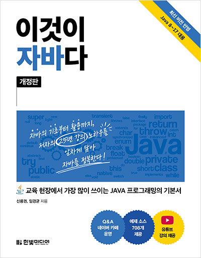

## [01_자바시작하기](https://github.com/TaskerJang/Java_study/blob/2c71a5a64867d5362411945f19db3139a8912f47/01_%EC%9E%90%EB%B0%94%EC%8B%9C%EC%9E%91%ED%95%98%EA%B8%B0.md) ##
## [02_변수와 타입](https://github.com/TaskerJang/Java_study/blob/2c71a5a64867d5362411945f19db3139a8912f47/02_%EB%B3%80%EC%88%98%EC%99%80%20%ED%83%80%EC%9E%85.md) ##
## [03_연산자](https://github.com/TaskerJang/Java_study/blob/2c71a5a64867d5362411945f19db3139a8912f47/03_%EC%97%B0%EC%82%B0%EC%9E%90.md) ##
## [04_조건문과 반복문](https://github.com/TaskerJang/Java_study/blob/2c71a5a64867d5362411945f19db3139a8912f47/04_%EC%A1%B0%EA%B1%B4%EB%AC%B8%EA%B3%BC%20%EB%B0%98%EB%B3%B5%EB%AC%B8.md) ##
## [05_참조 타입](https://github.com/TaskerJang/Java_study/blob/bcdf55689a729262d21122a424ff896954e4fa97/05_%EC%B0%B8%EC%A1%B0%20%ED%83%80%EC%9E%85.md) ##
## [06_클래스](https://github.com/TaskerJang/Java_study/blob/2a05b129771c44c78387a538187a7cda432253fa/06_%ED%81%B4%EB%9E%98%EC%8A%A4.md) ##
## [07_상속](https://github.com/TaskerJang/Java_study/blob/2a05b129771c44c78387a538187a7cda432253fa/07_%EC%83%81%EC%86%8D.md) ##
## [08_인터페이스](https://github.com/TaskerJang/Java_study/blob/2a05b129771c44c78387a538187a7cda432253fa/08_%EC%9D%B8%ED%84%B0%ED%8E%98%EC%9D%B4%EC%8A%A4.md) ##
## [09_중첩 선언과 익명 객체](https://github.com/TaskerJang/Java_study/blob/2a05b129771c44c78387a538187a7cda432253fa/09_%EC%A4%91%EC%B2%A9%20%EC%84%A0%EC%96%B8%EA%B3%BC%20%EC%9D%B5%EB%AA%85%20%EA%B0%9D%EC%B2%B4.md) ##
## [10_라이브러리와 모듈](https://github.com/TaskerJang/Java_study/blob/2a05b129771c44c78387a538187a7cda432253fa/10_%EB%9D%BC%EC%9D%B4%EB%B8%8C%EB%9F%AC%EB%A6%AC%EC%99%80%20%EB%AA%A8%EB%93%88.md) ##
## [11_예외 처리](https://github.com/TaskerJang/Java_study/blob/2a05b129771c44c78387a538187a7cda432253fa/11_%EC%98%88%EC%99%B8%20%EC%B2%98%EB%A6%AC.md) ##
## [12_java.base 모듈](https://github.com/TaskerJang/Java_study/blob/2a05b129771c44c78387a538187a7cda432253fa/12_java.base%20%EB%AA%A8%EB%93%88.md) ##
## [13_제네릭](https://github.com/TaskerJang/Java_study/blob/2a05b129771c44c78387a538187a7cda432253fa/13_%EC%A0%9C%EB%84%A4%EB%A6%AD.md) ##
## [14_멀티 스레드](https://github.com/TaskerJang/Java_study/blob/2a05b129771c44c78387a538187a7cda432253fa/14_%EB%A9%80%ED%8B%B0%20%EC%8A%A4%EB%A0%88%EB%93%9C.md) ##
## [15_컬렉션 자료구조](https://github.com/TaskerJang/Java_study/blob/2a05b129771c44c78387a538187a7cda432253fa/15_%EC%BB%AC%EB%A0%89%EC%85%98%20%EC%9E%90%EB%A3%8C%EA%B5%AC%EC%A1%B0.md) ##
## [16_람다식](https://github.com/TaskerJang/Java_study/blob/2a05b129771c44c78387a538187a7cda432253fa/16_%EB%9E%8C%EB%8B%A4%EC%8B%9D.md) ##
## [17_스트림 요소 처리](https://github.com/TaskerJang/Java_study/blob/2a05b129771c44c78387a538187a7cda432253fa/17_%EC%8A%A4%ED%8A%B8%EB%A6%BC%20%EC%9A%94%EC%86%8C%20%EC%B2%98%EB%A6%AC.md) ##
## [18_데이터 입출력](https://github.com/TaskerJang/Java_study/blob/2a05b129771c44c78387a538187a7cda432253fa/18_%EB%8D%B0%EC%9D%B4%ED%84%B0%20%EC%9E%85%EC%B6%9C%EB%A0%A5.md) ##
## [19_네트워크 입출력](https://github.com/TaskerJang/Java_study/blob/2a05b129771c44c78387a538187a7cda432253fa/19_%EB%84%A4%ED%8A%B8%EC%9B%8C%ED%81%AC%20%EC%9E%85%EC%B6%9C%EB%A0%A5.md) ##
## [20_데이터베이스 입출력](https://github.com/TaskerJang/Java_study/blob/2a05b129771c44c78387a538187a7cda432253fa/20_%EB%8D%B0%EC%9D%B4%ED%84%B0%EB%B2%A0%EC%9D%B4%EC%8A%A4%20%EC%9E%85%EC%B6%9C%EB%A0%A5.md) ##